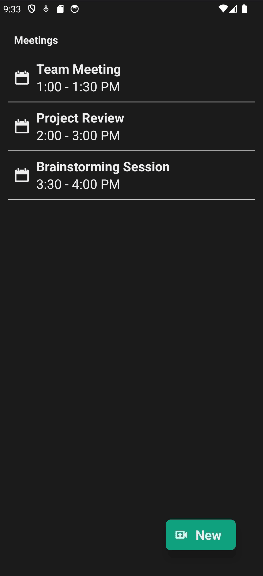

# VideoCall

> It's a simplified React Native component for a mobile app that integrates with Google Meet and displays a basic video calling screen. Additionally, the app utilizes a basic AI/ML solution for real-time transcript generation from the video call. (placeholder data are used to simulate the backend API response)



## Setup

### Clone this repository

```bash
$ git clone git@github.com:Sahar-AbdelSamad/VideoCall.git
$ cd VideoCall
```

### Run project

```bash
$ npm install
$ npx expo start
```


## Built With

- React Native
- JavaScript

## Authors

👤 **Sahar Abdel Samad**

- GitHub: [@sahar-abdelsamad](https://github.com/Sahar-AbdelSamad)
- Twitter: [@abdelsamadsahar](https://twitter.com/AbdelSamadSahar)
- LinkedIn: [abdel-samad-sahar](https://www.linkedin.com/in/sahar-abdel-samad/)

## 🤝 Contributing

Contributions, issues, and feature requests are welcome!

Feel free to check the [issues page](https://github.com/Sahar-AbdelSamad/VideoCall/issues).

## Show your support

Give a ⭐️ if you like this project!
